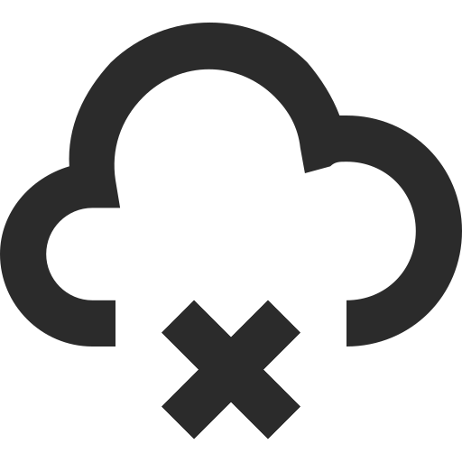

# Cookie & Session

연구개발본부 IT혁신팀 / Layla

---
layout: image-center
image: 'public/img1.png'
imageWidth: '720'
---
<!-- # 브라우저에서 쉽게 접하는 Cookie & Session -->

<!-- 

사이트를 이용할 때  
로그인하고 일정시간에 도달했을 때

 -->
---
layout: cover
---
# HTTP

  

     
    
비연결성(Connectionless)

  

  

     
    
비상태성(stateless)

  

 

---
layout: cover-logos
logos: [
  'https://img2.storyblok.com/588x0/filters::format(webp)/f/86387/x/21aa32ed18/logo-normal.svg',
  'https://nuxtjs.org/logos/nuxt-emoji.png',
]
---
# Cookie

---
layout: cover
---
# Session

---
layout: center
---

# Thank you
